+++
title = "[PyCon China 2026] It's Time to Learn (Some) Rust — Starting from a Faster pip install"
description = "PyCon China 2026 (Shanghai) Lightning Talk"
slug = "pycon-china-2026-lightning-talk"
date = 2026-09-05T15:10:00+08:00
authors = ["Zeyang Lin"]
tags = ["python", "rust", "pycon"]
categories = ["python", "rust"]
series = []
keywords = ["python", "pycon", "rust", "social", "China", "2026"]
image = "title.jpg"
draft = false
+++

# It's Time to Learn (Some) Rust — Starting from a Faster pip install

Hi everyone! This post is adapted from my lightning talk at PyCon China 2026, "It's Time to Learn (Some) Rust — Starting from a Faster pip install". What the subtitle means — I'll get to that in a moment.

Whether you've noticed it or not, Rust is already part of your daily life as a Python developer. uv, ruff, and pyrefly — Meta's open-source type checker — this new generation of Python tooling is all written in Rust. And plenty of Python libraries are bringing Rust in as well: pydantic v2 rewrote its validation core in Rust and got 17x faster; polars' entire engine is Rust; cryptography uses it to harden its core. So Rust stopped being "the language next door" a long time ago — it's hiding inside the dependencies of every `pip install` you run.

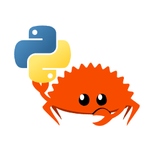

Even CPython's own source code may soon include Rust. Look at the timeline: in November 2025, the pre-PEP discussion thread opened; in March 2026, the forked CPython project's CI builds went green on all platforms; and at PyCon US 2026 in May, the working group unveiled zlib-py as the first planned pilot module — a drop-in alternative to the existing zlib module, with decompression running 3 to 6 times faster. If it lands, every `pip install` you run from then on will decompress faster. That's where the subtitle comes from.

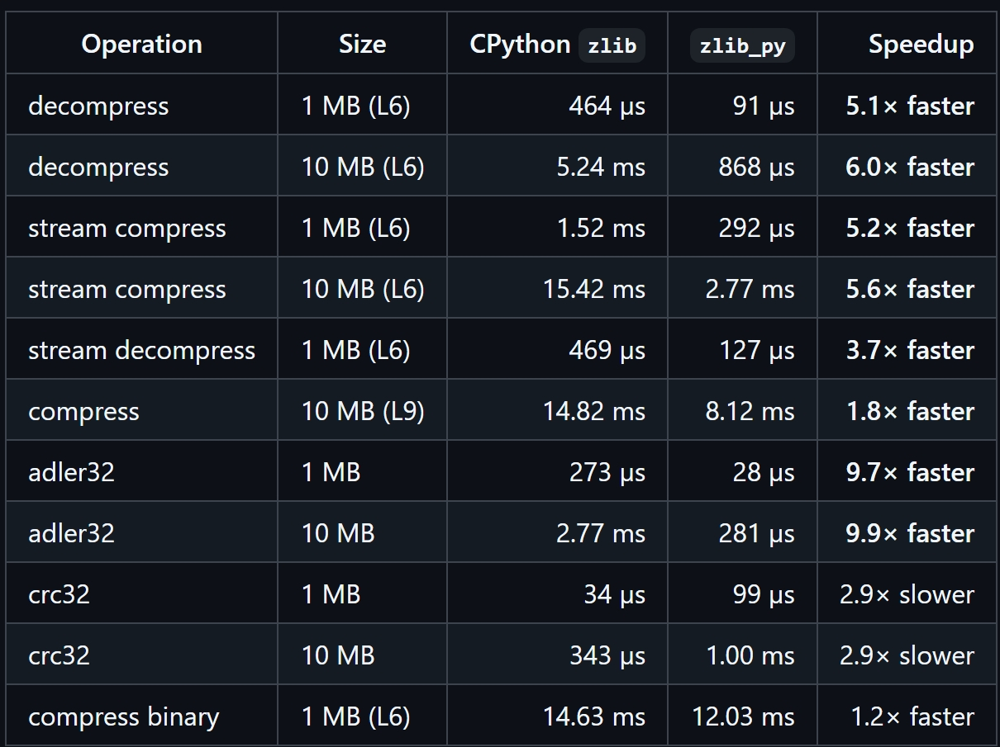

The bad news: the PEP originally planned for July has slipped. The good news: the reason is nothing external — the design details of the internal Rust API simply deserve to be worked through slowly and carefully. It's a slip, not a stall. Their target is Python 3.16, in 2027.

So next, let's see how simple getting started with Rust can be. It's like the old joke about putting an elephant into a fridge — three steps in total.

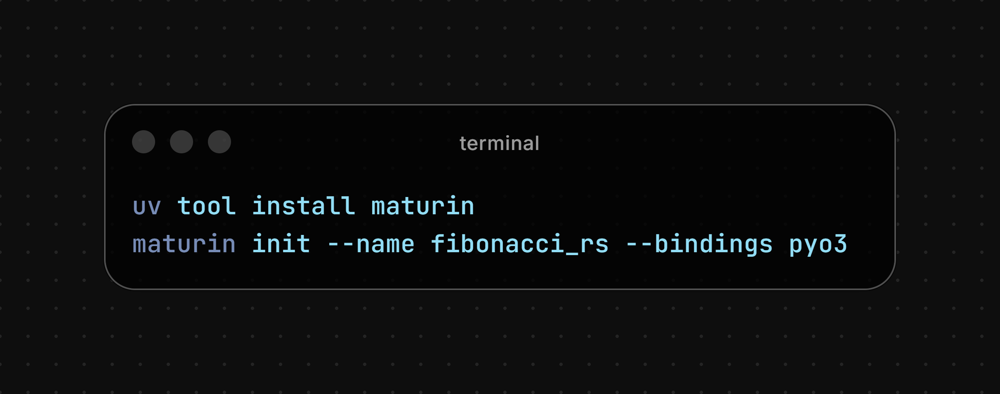

- Step one: install maturin with uv, then run `maturin init` — and a Rust project is initialized, ready to be packaged straight into a Python wheel.

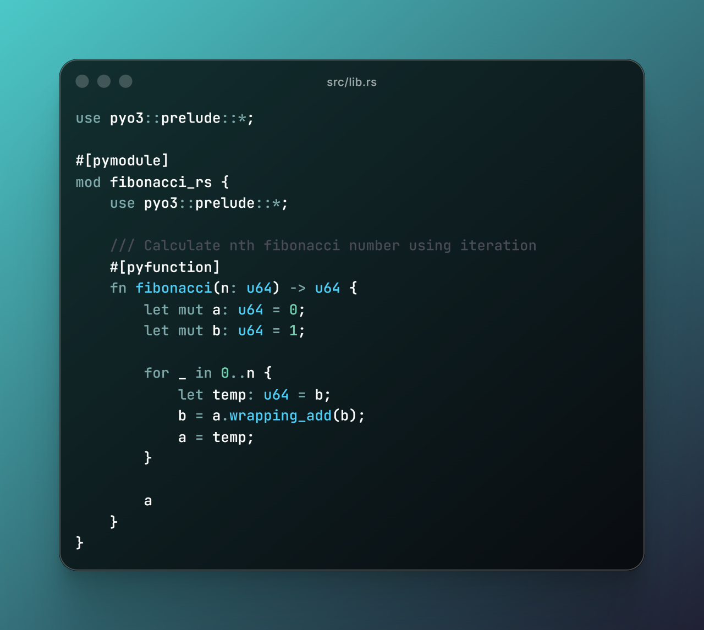

- Step two: in `lib.rs`, write a function that computes the n-th Fibonacci number. Only two macros in this code really matter: `#[pyfunction]` exposes the Rust function to Python, and `#[pymodule]` registers it as a Python module. The iterative logic in between is essentially the usual way you'd compute Fibonacci in Python — even with no Rust background, you can follow the gist.

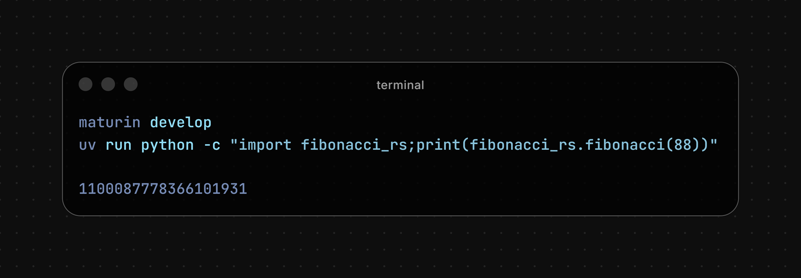

- Step three: `maturin develop`. That single command compiles the Rust package, builds a wheel, and installs it into your current Python virtual environment — building, packaging, and installation all in one go, an experience nearly identical to a pure-Python toolchain. Then it's back to Python: `import fibonacci_rs`, call `fibonacci(88)`, and the 88th Fibonacci number comes right out.

One sentence to sum it up: Python handles the orchestration; Rust does the computing.

Now, some of you may feel that computing Fibonacci numbers is a bit too simple — barely a step above Hello World.

So let's look at a somewhat more involved example: the Julia set. In short: take every point in the complex plane, repeatedly apply z = z² + c (with c a fixed complex number), and see which points never fly off to infinity (modulus above a threshold).

In my concrete example, the canvas is 1000×1000 — one million points in total, each iterated at most 300 times. In the figure, the black areas are points that escaped quickly; the brighter the region, the more iterations it took to escape; and the white, snowflake-shaped region in the middle marks points that still hadn't escaped after 300 iterations. This is a CPU-bound task — precisely the territory where Python is considered relatively weak.

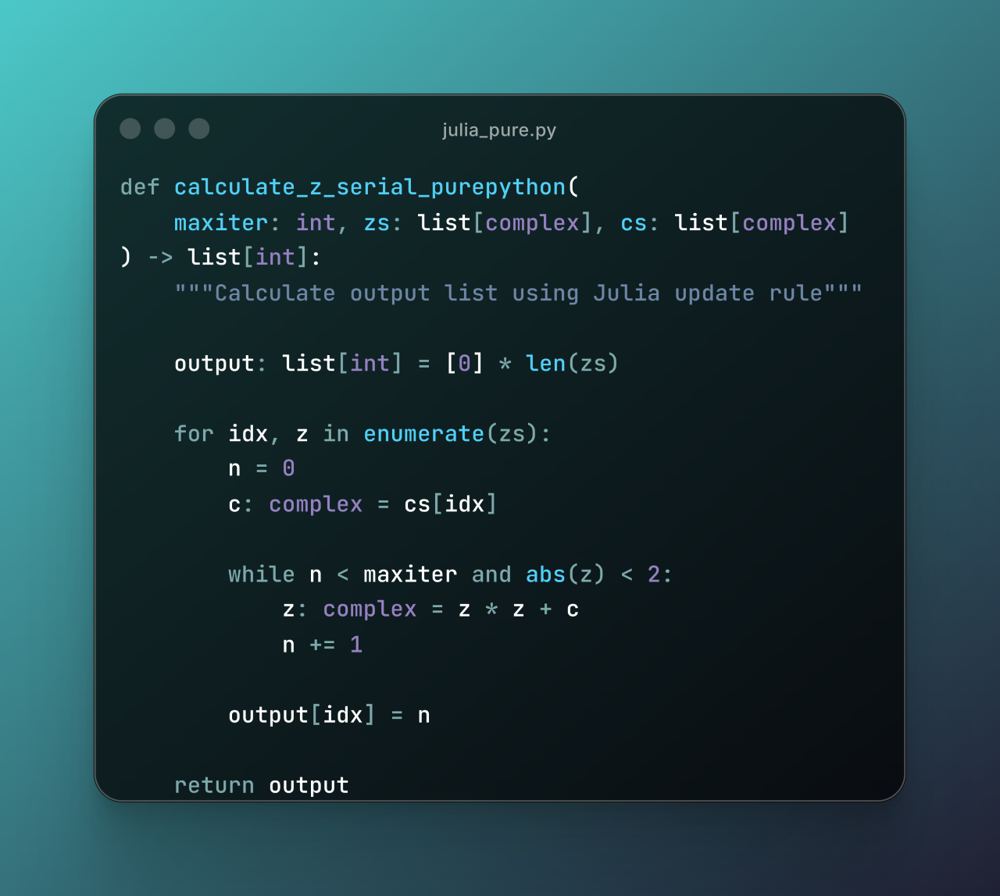

We start with the pure-Python version: an honest, plain double loop. A run of line_profiler makes the picture stark: this one function devours 96.1% of the program's total time, while the two list operations above it — each executed a million times — account for just 1.4% and 1.5% respectively.

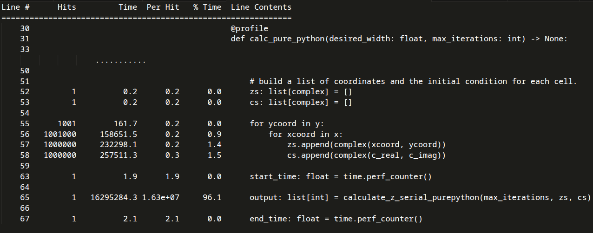

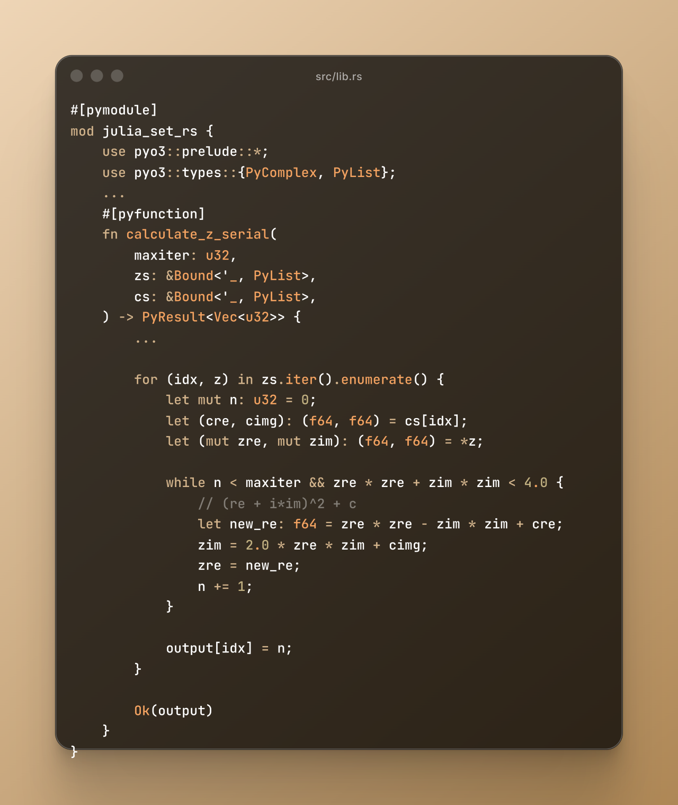

Still using maturin, we write a Rust function, `calculate_z_serial`, that mirrors the pure-Python function roughly one-to-one in logic.

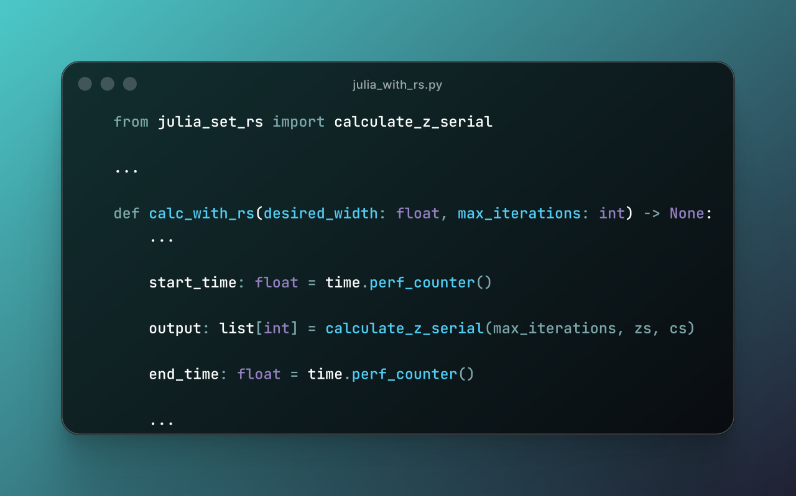

Once it's written, the Python script needs exactly one added import line and one changed function name — that's it. From the caller's point of view, the function signature and behavior are completely unchanged.

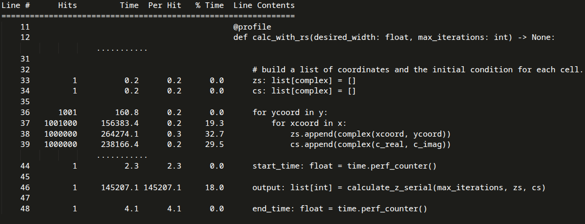

Now we run line_profiler again: the function's share of runtime drops from 96% straight down to 18% — the biggest time sinks are now Python's for loops and list operations — and the script's total runtime falls from 3.008 seconds to 0.144 seconds, a speedup of more than 20x. And that's with a faithful serial port of the original; bring in Rayon for multithreaded parallelism, and the speedup tops 100x.

If, after these two examples, you'd like to try building something in Rust, it's worth first understanding the four mindset hurdles that lie between writing Python and writing Rust.

First, from recommended explicitness to enforced explicitness: Python's "explicit is better than implicit" is advice; Rust makes it law — mutating data requires declaring `mut`, `match` must be exhaustive, and if you don't comply, it refuses to compile.

Second, from referencing data to owning it: in Python, assignment is sticking a name tag on an object — share it freely, and the GC cleans up. In Rust, every value has exactly one owner, and whether it's moved or borrowed is checked with total clarity at compile time.

Third, from EAFP to LBYL — from "easier to ask forgiveness than permission" to "look before you leap": Rust writes "can this fail?" into the types. With `Option` and `Result`, you can't touch the value without checking it first.

Fourth, from the GIL to real concurrency: data races become compile errors — if your program compiles, it is guaranteed free of data races.

Here's a reference roadmap for learning Rust, in four stages.

Stage one, syntax bridging — with a Python foundation, you'll get up to speed quickly.

Stage two is the climb: ownership, borrowing, error handling, traits, closures — possibly the most painful stretch of the entire journey, but push through it and the change is qualitative.

Stage three, concurrency. `std::thread` has you writing real multithreaded code; shared mutable state gets the standard `Arc`-plus-`Mutex` combo; and whether data may cross thread boundaries is policed by the compiler through `Send`/`Sync`. Want to keep it easy? Rayon turns a loop into data-parallel execution with one line; for I/O-bound concurrency, there's tokio, the async runtime.

Last and most important: hands-on practice. Use maturin to rewrite a hot function from your own project — profile to locate it, test for parity, benchmark to compare — closing the loop.

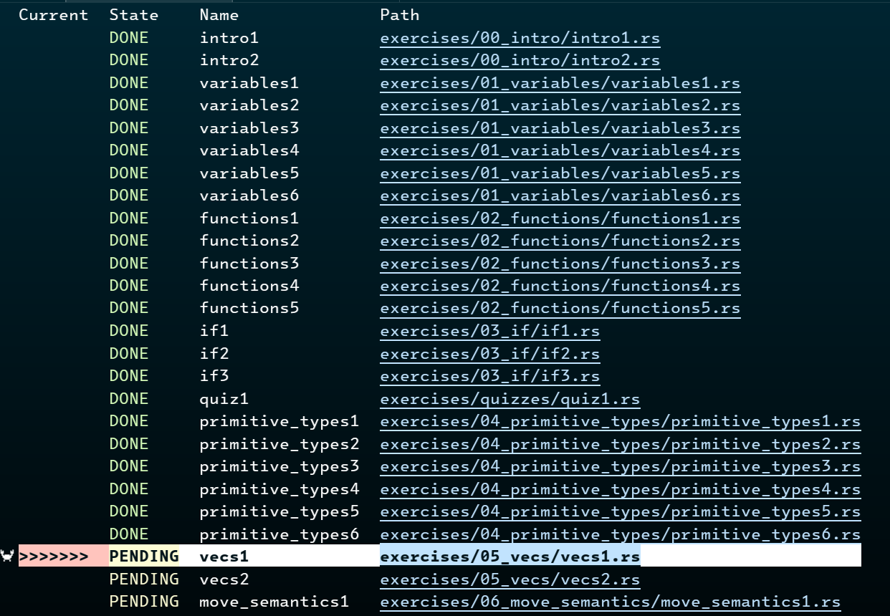

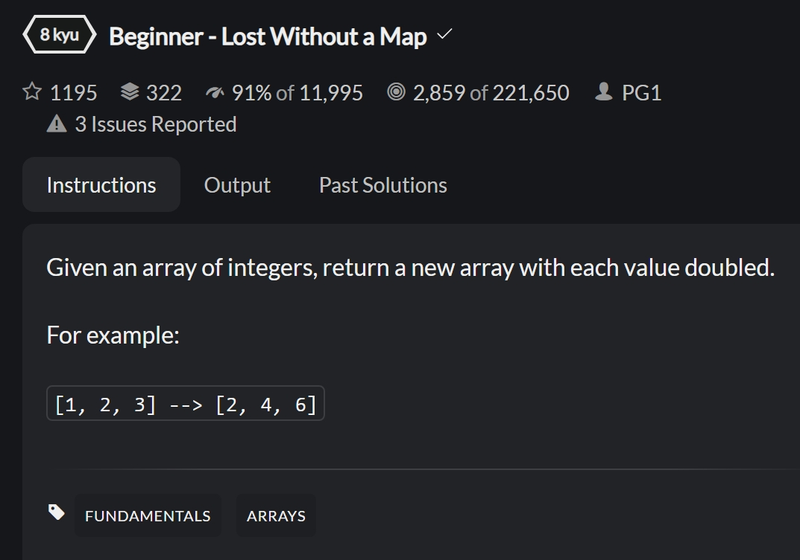

As we all know, writing code while you learn is one of the most effective ways to surface problems and consolidate knowledge. These are the three tools I found most helpful as a beginner: Rustlings — around ninety bite-sized exercises straight from the official project, a few minutes each, running locally; and Codewars and LeetCode, which both let you solve problems in Rust directly. Re-solving problems you previously did in Python — this time in Rust — makes the differences between the two languages far easier to internalize.

So does this mean all your Python code should become Rust? Before you start, remember: profiling first — confirm the bottleneck before talking about a rewrite. Don't go on a hunch.

Good candidates for a rewrite: CPU-bound modules with clear boundaries that process untrusted input; I/O-bound code and glue code can often stay as they are.

Before you dive in, also look at the alternatives: a better algorithm, a free-threaded build, an existing third-party library — or Cython, Numba, or GPU acceleration. Any of these may be the better deal.

Of course, real-world decisions are more complicated — team skills and migration cost come into play, among other factors. And remember this line: Rust is not a "press for speed" button — speed has always been the reward for choosing the right problem.

If you still feel Rust is too hard to learn, consider it from another angle: even if you never write production-grade Rust, the time is not wasted. Explicit types, ownership, explicit error handling, exhaustive matching — these habits of mind transfer back and make your Python more rigorous.

OK, to wrap up. Rust is not Python's rival — it's Python's partner: Python for orchestration, Rust for speed and safety. And learning Rust is more than an investment in personal skills: judging by the progress of Rust for CPython, it may be your ticket to contributing to CPython. The next Rust for CPython contributor might well be you, reading this article right now.

Of course, this talk would not exist without the valuable material left behind by pioneers in the community — Microsoft's Rust for Python Programmers course, plus several excellent talks and articles, all listed below. My thanks to all of them.

- Microsoft — [_Rust for Python Programmers_](https://microsoft.github.io/RustTraining/python-book/) (open course)
- Daroc Alden — ["Eventual Rust in CPython"](https://lwn.net/Articles/1046933/)
- Bob Belderbos — ["Learning Rust Made Me a Better Python Developer"](https://belderbos.dev/blog/rust-made-me-a-better-python-developer/)
- Daniel Szoke — ["Why You, a Python Developer, Should Learn Rust"](https://www.youtube.com/watch?v=lkSxUIdP6Ds)
- Emma Smith — ["Rust for CPython: Making Python Safer and More Robust for Everyone"](https://www.youtube.com/watch?v=42kibVnUHYE)
- Micha Gorelick & Ian Ozsvald — [_High Performance Python_, 2nd Edition](https://www.oreilly.com/library/view/high-performance-python/9781492055013/)

That's the whole talk. The demo code is on [GitHub](https://github.com/linzeyang/pycon-china-2026), and if you're interested, you're welcome to find me on any of these platforms to keep the conversation going. Thanks for reading!

- GitHub: [@linzeyang](https://github.com/linzeyang)
- Bluesky: [@linzeyang.bsky.social](https://bsky.app/profile/linzeyang.bsky.social)
- Mastodon: [@zeyanglin@mastodon.online](https://mastodon.online/@zeyanglin)
