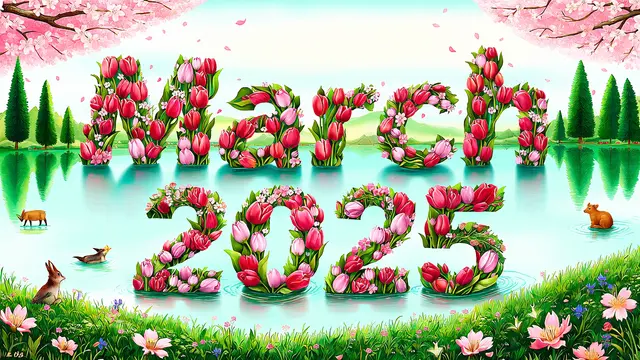

+++
title = 'This Month for Pythonista - March 2025'
description = "a monthly update on Python and other fun stuff"
slug = "this-month-for-pythonista-2025-03"
date = 2024-03-31T15:00:00+08:00
authors = ["Zeyang Lin"]
tags = ["python", "cli", "linux", "windows"]
categories = ["python"]
series = ["this month for pythonista"]
keywords = ["python", "linux", "github"]
draft = false
+++

```python
from datetime import date

print(date.today().year, date.today().month)
# 2025 3
```



Welcome to **This Month for Pythonista**, a monthly update dedicated to Python developers, professionals and hobbists.

In this issue I would like to compile a list of news, repositories, tools worth noticing in March 2025 and/or other fun stuff which does not necessarily bound to Python.

Ready? Let's get started!

## New versions

### ipython 9.0.1

The first major version update in three years. [pypi](https://pypi.org/project/ipython/9.0.1/)

## Tutorials

TBD

## Articals

TBD

## Podcasts

### RealPython PodCast

- [Episode 241: Deciphering Python Jargon & Compiling Python 1.0](https://realpython.com/podcasts/rpp/241/)

## Tools

### Cherry Studio 1.0.6

Cherry Studio catches quite a lot of eyes recently, and it just reaches 1.0 release not too long ago. [official download](https://cherry-ai.com/download)

## Repositories

### lmstudio-python 1.0.1

I personally have been using [LM Studio](https://lmstudio.ai/) for roughly one year, and this `lmstudio-python` (alongside lmstudio-js for JavaScript) is their official SDK with which you can easily manage the models, conversations and more using pure Python code. They have documentations too: [docs](https://lmstudio.ai/docs/python)

The source code is hosted on [github](https://github.com/lmstudio-ai/lmstudio-python).

## Time for some fun?

### Command & Conquer games go open-source

EA chose to open-source some of the classic C&C games on github, potentially enriching the Modding community support.

They are on github too.

- [Tiberian Dawn (1995)](https://github.com/electronicarts/CnC_Tiberian_Dawn)
- [Red Alert (1996)](https://github.com/electronicarts/CnC_Red_Alert)
- [Renegade (2002)](https://github.com/electronicarts/CnC_Renegade)
- [Generals (2003) and Generals: Zero Hour (2003)](https://github.com/electronicarts/CnC_Generals_Zero_Hour)
