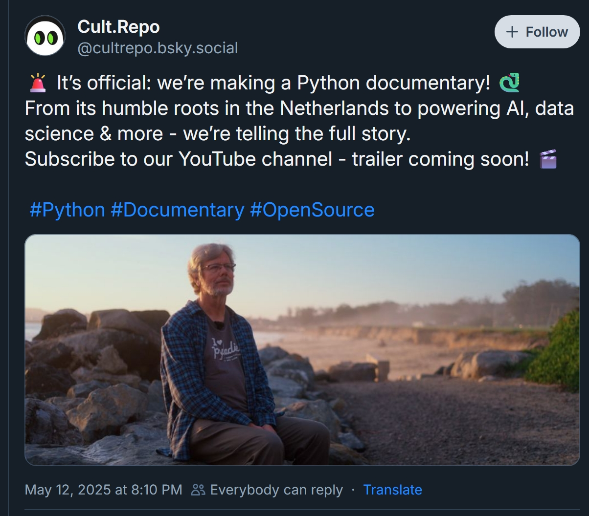

+++
title = "This Month for Pythonistas - May 2025"
description = "PyCon US, MS Build, Python 3.14 beta, more MCP and other fun stuff"
slug = "this-month-for-pythonistas-2025-05"
date = 2025-05-30T20:00:00+08:00
authors = ["Zeyang Lin"]
tags = ["python", "cli", "linux", "podcast", "news"]
categories = ["python"]
series = ["this month for pythonistas"]
keywords = ["python", "pypi", "pycon", "linux", "github", "podcast", "AI", "LLM", "agent", "mcp"]
image = "title.webp"
draft = false
+++

```python
from datetime import date

print(date.today().year, date.today().month)
# 2025 5
```


Welcome back! I'm glad to see you back reading the third issue of my "This month for Pythonistas" series which curates the news, articles, tutorials and more Python stuff worth noting in this May. This May witnesses several conferences, Python 3.14 Beta 1 & 2, more tooling, and more _Agentic_ stuff.

Before we continue, please note that this blog is synced across several platforms:

- [Github Pages](https://blueberry-py.github.io/blog/post/this-month-for-pythonistas-2025-05/)
- [Netlify](https://blueberrypy.netlify.app/post/this-month-for-pythonistas-2025-05/)
- [Render](https://blueberrypy.onrender.com/post/this-month-for-pythonistas-2025-05/)

Ready? Let's get started!

---

## Events & Social

### PyCon US 2025

(Many of) the video recordings are available on PyCon US YouTube channel.

### Microsoft Build 2025

- Github Copilot Chat Extension for VS Code is going open-source.
- Github Copilot coding agent is in public preview for Copilot Enterprise and Copilot Pro+ users.
- Github Models is integrated at repository level.
- Native MCP support is going to land in Windows 11.
- xAI's Grok 3 and Grok 3 mini are available via Azure AI Foundry.
- Windows Subsystem for Linux (WSL) is fully open-sourse.
- A command line text editor called "Edit" is coming to Windows 11, and its source code would be available too.

### Google I/O 2025

- New models - Veo 3, Imagen 4, and Flow - are announced.
- Gemma-3n is dedicated to mobile and edge device use cases.
- Project Mariner, Project Astra
- Jules, an asynchronous coding agent, is now in public preview.
- Gemini 2.5 Flash, the fastest version of Gemini, is coming this June.
- Gemini 2.5 is brought to Google Search, the "AI mode" is currently open to users in United States.

### Announcing the PyTorch Docathon 2025

[This docathon](https://pytorch.org/blog/docathon-2025/) is a hackathon-style event aimed at enhancing PyTorch documentation with the support of the community.

### Python Documentary

A documentary about Python is coming. It will debut in July at EuroPython 2025 and will be available on YouTube as well.



## New versions

### Python 3.14.0 beta 1 and beta 2

The first and second of four planned beta releases of 3.14 are here! Source code as well as binary distributions can be found [here](https://www.python.org/downloads/release/python-3140b1/) and [here](https://www.python.org/downloads/release/python-3140b2/).

### wagtail 7.0 LTS

This is a major update and the first ever LTS release of Wagtail, which aligns with Django 5.2 LTS.

For more check their blog post [Flying into a new era with Wagtail 7.0](https://wagtail.org/blog/wagtail-70/).

### redis-py 6.2

This major release happened while Redis 8 is GA and the source code goes back to true open-source. Support for `HGETDEL`, `HGETEX`, and `HSETEX` commands are added. `VectorSet` commands are added as experimental features.

## Tutorials

- DeepLearning.ai's [LLMs as Operating Systems: Agent Memory](https://www.deeplearning.ai/short-courses/llms-as-operating-systems-agent-memory/) from Letta

> Learn how to build agentic memory into your applications in this short course, LLMs as Operating Systems: Agent Memory, created in partnership with Letta, and taught by its founders Charles Packer and Sarah Wooders.

- DeepLearning.ai's [Building AI Voice Agents for Production](https://www.deeplearning.ai/short-courses/building-ai-voice-agents-for-production/)

> In this course, you’ll learn how to build voice agents that listen, reason, and respond naturally. You’ll follow the architecture used to create Andrew Avatar, a collaborative project between DeepLearning.AI and RealAvatar that responds to users in Andrew Ng’s voice.

- DeepLearning.ai's [MCP: Build Rich-Context AI Apps with Anthropic](https://www.deeplearning.ai/short-courses/mcp-build-rich-context-ai-apps-with-anthropic/)

> Explore how MCP standardizes access to tools and data for AI applications, its underlying architecture, and how it simplifies the integration of new tools and connections to external systems.

- Deeplearning.ai's [Reinforcement Fine-Tuning LLMs with GRPO](https://www.deeplearning.ai/short-courses/reinforcement-fine-tuning-llms-grpo/) from Predibase

> In this course, you’ll take a technical deep dive into RFT with GRPO. You’ll learn how to build reward functions that you can use in the GRPO training process to guide an LLM toward better performance on multi-step reasoning tasks.

- HuggingFace's [MCP Course](https://huggingface.co/learn/mcp-course/unit0/introduction)

> In this course, you will:
>
> 📖 Study Model Context Protocol in theory, design, and practice.
>
> 🧑‍💻 Learn to use established MCP SDKs and frameworks.
>
> 💾 Share your projects and explore applications created by the community.
>
> 🏆 Participate in challenges where you will evaluate your MCP implementations against other students’.
>
> 🎓 Earn a certificate of completion by completing assignments.

- RealPython's [Modern Web Automation With Python and Selenium](https://realpython.com/modern-web-automation-with-python-and-selenium/)

This tutorial introduces modern web automation using Python and Selenium, focusing on practical techniques for navigating and interacting with web pages. It explains how to navigate web pages, locate elements within the DOM, and interact with them through clicks, keystrokes, and form submissions.

- RealPython's [Managing Python Projects With uv: An All-in-One Solution](https://realpython.com/python-uv/)

`uv` is designed to streamline workflows by providing an all-in-one solution that integrates installation, package management, and environment setup. The guide covers how to install uv using a standalone installer or through other package managers, and demonstrates its use cases in managing complex projects.

## Articles

- [PEP 773 – A Python Installation Manager for Windows](https://peps.python.org/pep-0773/)

PEP 773 is **accepted**. It proposes a new Python installation manager for Windows, called PyManager. The current installation methods for Python on Windows have several limitations and challenges, including mismatched user expectations and unreliability. PyManager aims to address these issues by providing a single, unified installation management tool that can handle multiple Python versions and provide a more streamlined user experience. It will be distributed through both the Windows Store and python.org as an MSIX package.

- [PEP 784 – Adding Zstandard to the standard library](https://peps.python.org/pep-0784/)

PEP 784 is **accepted**. It proposes adding a new module to the Python standard library for Zstandard compression, a widely adopted and highly efficient compression standard. It aims to provide a unified interface for compression modules, reduce user confusion, and enable future additions of new compression formats. The reference implementation is based on the pyzstd project and includes integration with `tarfile`, `shutil`, and `zipfile` modules.

- [Unravelling t-strings](https://snarky.ca/unravelling-t-strings/)

T-strings expose the parser used for f-strings, allowing introspection of the parts inside the curly braces. Brett demonstrates how to replicate f-string behavior using Python code to parse and format the components (value, conversion, and format spec) of t-strings. This parsing helps understand how expressions inside f-strings are evaluated and formatted internally.

- [Python Tooling at Scale: LlamaIndex’s Monorepo Overhaul](https://www.llamaindex.ai/blog/python-tooling-at-scale-llamaindex-s-monorepo-overhaul)

Llama-index managed to contain 650+ community packages in their monorepo. They migrated away from `Poetry` and `Pants` to `uv` and `LlamaDev` for faster, simpler development.

- [Pyrefly vs. ty: Comparing Python’s Two New Rust-Based Type Checkers](https://blog.edward-li.com/tech/comparing-pyrefly-vs-ty/)

Both `pyrefly` and `ty` are promising new type checkers that aim to improve the Python type checking experience. While they share some similarities, they have different design goals and philosophies. `ty` takes a gradual approach to typing, while `pyrefly` is more aggressive in type inference. As both tools are still in early alpha, it will be interesting to see how they evolve in the future.

- [Takeaways from DjangoCon EU 2025](https://www.zachbellay.com/posts/djangocon-eu-2025/)

The article summarizes key takeaways from DjangoCon EU 2025 in Dublin, highlighting the community's enthusiasm and valuable technical insights. Topics include database management techniques such as row locking with select_for_update, moving to BigInt primary keys, and partitioning large tables for performance. It also covers optimization strategies like reducing PostgreSQL index sizes significantly by using partial indexes.

- [PyTorch: The Open Language of AI](https://pytorch.org/blog/pytorch-the-open-language-of-ai/)

PyTorch has evolved from a framework focused on AI research to supporting production, deep AI compilation and has become foundational to thousands of projects and companies in the AI ecosystem. The PyTorch Foundation is expanding to be an umbrella organization and will now house some of the most popular and highly complementary projects making it easier for users to build AI at scale.

- [The first year of free-threaded Python](https://labs.quansight.org/blog/free-threaded-one-year-recap)

The first year of free-threaded Python has seen significant progress in enabling Python to fully utilize multicore CPUs and GPUs by removing the Global Interpreter Lock (GIL). Major packages and tools like NumPy, SciPy, Cython, and setuptools have been updated to support the free-threaded build. While many packages still require auditing and fixes for thread safety, the ecosystem has improved considerably.

- [Asyncio Demystified: Rebuilding it From Scratch One Yield at a Time](https://dev.indooroutdoor.io/asyncio-demystified-rebuilding-it-from-scratch-one-yield-at-a-time)

The article demystifies `asyncio` by rebuilding it from scratch. It starts with a primer on generators and coroutines, explaining how they can pause and resume execution. The article builds a custom event loop, showcasing an echo server example. The goal is to understand how `asyncio` works under the hood, removing the "magic" behind asynchronous programming in Python.

- [MCP explained without hype or fluff](https://blog.nilenso.com/blog/2025/05/12/mcp-explained-without-hype-or-fluff/)

The author shares a concrete example of an MCP server built for accessing CKAN open data, enabling AI applications to explore and analyze government datasets. Despite MCP’s evolving nature and some overhead, its adoption is strong, providing a standardized way to decouple AI clients from platform-specific tools and workflows, valuable for integrations requiring flexibility and breadth.

- [MCP is a powerful new AI coding technology: Understand the risks](https://www.reversinglabs.com/blog/mcp-powerful-ai-coding-risk)

While MCP offers powerful capabilities, it poses significant security risks because it is not secure by default. Experts warn that deploying MCP in production environments without robust safeguards is risky. However, ongoing efforts from industry and security researchers aim to enhance MCP’s security, making it a promising but still maturing technology.

- [A Critical Look at MCP](https://raz.sh/blog/2025-05-02_a_critical_look_at_mcp)

The author argues that the protocol's documentation is poorly written, confusing, and glosses over important aspects. The author also criticizes the use of Python and JavaScript for examples, and the complexity of the protocol's multiple transport modes, including HTTP+SSE and "Streamable HTTP". It is suggested that WebSockets would be a better choice for transport, and that the protocol's flexibility introduces security concerns and complexity. The author also mentions alternative protocols, such as ACP and A2A.

- [Claude Opus 4 and Claude Sonnet 4](https://www.anthropic.com/news/claude-4)

Claude 4 Opus leads in complex, sustained coding tasks, excelling in memory usage and long-term focus, while Claude 4 Sonnet offers balanced performance and efficiency for everyday use, particularly powering GitHub Copilot. Both models support extended thinking with tool use, improved memory for handling local files, and parallel tool execution.

## Podcasts

### 🥝 core.py

- [Episode 22: Beta Frenzy](https://open.spotify.com/episode/5ZTwjntjAM3230I86ylKgi)

### DjangoChat

- [DjangoCon Europe 2025 Recap](https://djangochat.com/episodes/djangocon-europe-2025-recap)

### 🐍 RealPython Podcast

- [Episode 248: Experiments With Gen AI, Knowledge Graphs, Workflows, and Python](https://realpython.com/podcasts/rpp/248/)
- [Episode 249: Going Beyond requirements.txt With pylock.toml and PEP 751](https://realpython.com/podcasts/rpp/249/)
- [Episode 250: DjangoCon Europe 2025: Live Recording From Dublin](https://realpython.com/podcasts/rpp/250/)
- [Episode 251: Python Thread Safety & Managing Projects With uv](https://realpython.com/podcasts/rpp/251/)

### 🥧 Python Bytes Podcast

- [#431 Nerd Gas](https://pythonbytes.fm/episodes/show/431/nerd-gas)
- [#432 How To Fix Your Computer](https://pythonbytes.fm/episodes/show/432/how-to-fix-your-computer)
- [#433 Dev in the Arena](https://pythonbytes.fm/episodes/show/433/dev-in-the-arena)

### 🦜 Talk Python to me

- [#504: Developer Trends in 2025](https://talkpython.fm/episodes/show/504/developer-trends-in-2025)
- [#505: t-strings in Python (PEP 750)](https://talkpython.fm/episodes/show/505/t-strings-in-python-pep-750)
- [#506: ty: Astral's New Type Checker (Formerly Red-Knot)](https://talkpython.fm/episodes/show/506/ty-astrals-new-type-checker-formerly-red-knot)

### 🍕 Pybites Podcast

- [#189: The Year of Oui: Huy Nguyen on Connection, Community and Showing Up](https://www.pybitespodcast.com/1501156/episodes/17100578-189-the-year-of-oui-huy-nguyen-on-connection-community-and-showing-up)
- [#190: The power shift - Flexa’s data-driven energy revolution](https://www.pybitespodcast.com/1501156/episodes/16636722-190-the-power-shift-flexa-s-data-driven-energy-revolution)
- [#191: Code, click, cloud - how Sebastián Ramírez is taking FastAPI to the next level](https://www.pybitespodcast.com/1501156/episodes/17202534-191-code-click-cloud-how-sebastian-ramirez-is-taking-fastapi-to-the-next-level)

## Repositories

- [facebook/pyrefly](https://github.com/facebook/pyrefly) (MIT)

One of the tools I mentioned earlier. `pyrefly` is Meta's brand new type checker for Python at very ealy stage. Read more about it on [Facebook Engineering](https://engineering.fb.com/2025/05/15/developer-tools/introducing-pyrefly-a-new-type-checker-and-ide-experience-for-python/).

- [astral-sh/ty](https://github.com/astral-sh/ty) (MIT)

The other tool I mentioned earlier. Powered by Rust, `ty` is Astral's standalone static type checker for Python but developed as part of `ruff`, previously known as "Red-Knot". It comes with a command-line utility as well as a VS Code extension.

- [microsoft/magentic-ui](https://github.com/microsoft/magentic-ui) (MIT)

Magentic-UI is a **research prototype** of a human-centered interface powered by a multi-agent system that can browse and perform actions on the web, generate and execute code, and generate and analyze files. Magentic-UI is built using AutoGen and provides a platform to study human-agent interaction and experiment with web agents.

## Have time for some fun?

- Gears of War: Reloaded Comes to Xbox Series, PlayStation 5 and Steam this August


This is a Remastered version of the first ever game in its franchise, featuring 4K/60FPS in the Campaign with HDR, Dolby Atmos, cross-platform play, etc. Those who own the digital version of Gears of War: Ultimate Edition would receive a free upgrade to Gears of War: Reloaded.

Read more on [xbox.com](https://news.xbox.com/en-us/2025/05/05/gears-of-war-reloaded-release-date/).

---

As we wrap up this journey together, I want to take a moment to express my gratitude for your reading. If you've enjoyed what you just read and would like to help sustain this blog, consider [starring this blog on github](https://github.com/blueberry-py/blog/stargazers), it would be great motivation for me to keep updating the blogs!

Alright, that concludes the third issue of "This Month of Pythonistas". Thank you again for reading my post. I hope you enjoy it or find something useful, and see you in June!
