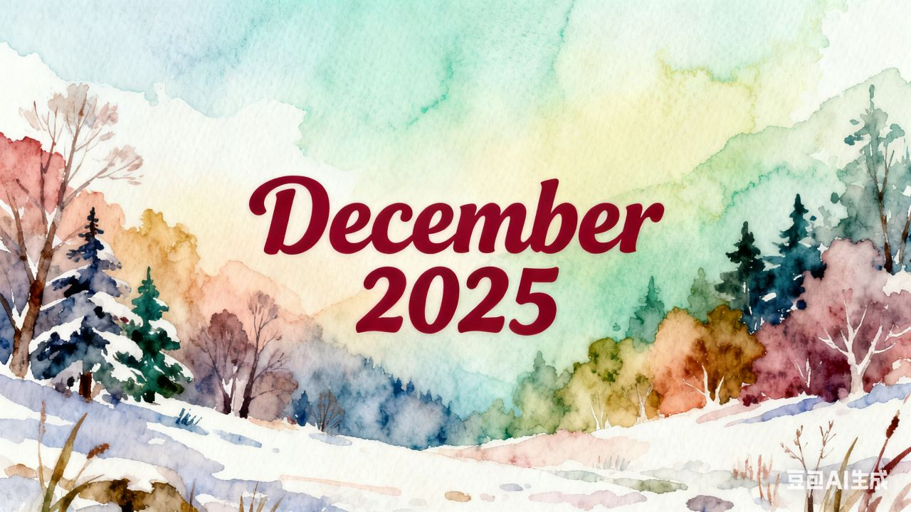

+++
title = "This Month for Pythonistas - December 2025"
description = "Python 3.15 Alpha, Django 6.0, Vercel on Python, GPT 5.2 and more holiday coding fun"
slug = "this-month-for-pythonistas-2025-12"
date = 2025-12-31T16:00:00+08:00
authors = ["Zeyang Lin"]
tags = ["python", "news", "podcast", "ai"]
categories = ["python"]
series = ["this month for pythonistas"]
keywords = ["python", "news", "ai", "django", "vercel", "podcast", "openai", "gemini"]
image = "title.jpg"
draft = false
+++

```python
from datetime import date

print(date.today().year, date.today().month)
# 2025 12
```



Welcome back Pythonistas! It's the final month of 2025 (happy holidays!), and we have a lot to catch up on before the new year rings in.

Before we continue, please note that this blog is synced across the following platforms:

- [Github Pages](https://blueberry-py.github.io/blog/post/this-month-for-pythonistas-2025-12/)
- [Netlify](https://blueberrypy.netlify.app/post/this-month-for-pythonistas-2025-12/)
- [Render](https://blueberrypy.onrender.com/post/this-month-for-pythonistas-2025-12/)
- [Vercel](https://blueberrypy-blog.vercel.app/post/this-month-for-pythonistas-2025-12/)

Ready? Let's get started!

---

## Events & Social

### [Investing in the Python ecosystem](https://vercel.com/blog/investing-in-the-python-ecosystem)


**Vercel** has announced a significant expansion into the Python ecosystem by hiring the team behind **Gel Data**, led by renowned Python core developer _Yury Selivanov_ and contributor _Elvis Pranskevichus_. Known for creating high-performance tools like `uvloop` and `asyncpg`, this team will spearhead Vercel's efforts to bring world-class Python support to its AI Cloud.

This move marks a strategic shift for Vercel beyond its JavaScript and TypeScript roots, aiming to make Python deployment as seamless and fast as its existing frontend workflows. As part of this initiative, Vercel plans to improve Python framework support and actively contribute to the open-source tools the community relies on.

To demonstrate its commitment, Vercel is investing directly in the Python community through several initiatives:

- Becoming a Maintaining-level sponsor of the Python Software Foundation (PSF).
- Sponsoring core developer _Serhiy Storchaka_ for a full year to support his work on the interpreter and standard library.
- Funding key conferences, local meetups, and a planned hackathon.

Regarding the acquisition, Vercel clarified that the Gel Data platform itself will _wind down_ by **January 31, 2026**, though its open-source components will remain available. The deal is focused strictly on acquiring Python expertise rather than entering the database market; Vercel intends to continue partnering with existing database providers via its marketplace.

### [Why developers still flock to Python: Guido van Rossum on readability, AI, and the future of programming](https://github.blog/developer-skills/programming-languages-and-frameworks/why-developers-still-flock-to-python-guido-van-rossum-on-readability-ai-and-the-future-of-programming/)

Despite TypeScript [recently overtaking](https://github.blog/news-insights/octoverse/octoverse-a-new-developer-joins-github-every-second-as-ai-leads-typescript-to-1/) Python in GitHub popularity, Python creator Guido van Rossum remains optimistic about his language's future. In this interview, he attributes Python's enduring success —- including a 49% year-over-year growth —- to its core philosophy of readability and developer friendliness.

Guido highlights Python's critical role in the AI boom, driven by a massive ecosystem (NumPy, PyTorch) rather than just syntax. He argues against enforcing strict typing for AI's sake, believing tools should adapt to humans. Ultimately, Python’s accessibility to non-CS backgrounds and commitment to backward compatibility ensure it remains a foundational tool for the next generation of developers.

### [The Rise and Rise of FastAPI](https://www.youtube.com/watch?v=mpR8ngthqiE)

Sebastián Ramirez, the creator behind FastAPI, talks about his background, motivation, inspiration, and surprise at the meteoric rise of his open source project in this short documentary produced by CultRepo.

### [AWS re:Invent 2025](https://reinvent.awsevents.com/)


- Nova 2: Lite, Pro, Sonic and Omni, all with multi-modal capabilities
- Nova Forge: blend proprietary data with Amazon Nova-curated training data and host custom models securely on AWS.
- Kiro Powers:
- strands-agents: TypeScript variant now in preview
- Frontier agents: autonomous, scalable agents which can work for hours or days without intervention
- AWS Lambda durable functions: build resilient multi-step applications and AI workflows that can execute for up to one year
- AWS Transform custom: AI-powered custom modernization for code, APIs, etc.

### [Introducing GPT-5.2](https://openai.com/index/introducing-gpt-5-2/)

OpenAI introduced **GPT-5.2**, their "most powerful" model series designed for professional knowledge work and persistent agents. The model significantly enhances capabilities in spreadsheet creation, presentation design, coding, image recognition, long-context understanding, and complex multi-step projects.

Key benchmarks show substantial improvements: GDPval knowledge work tasks at 70.9% (vs. 38.8% for GPT-5), SWE-Bench Pro software engineering at 55.6%, GPQA Diamond scientific questions at 92.4%, and near-perfect long-context reasoning (100% accuracy on 4-needle MRCR tests up to 256k tokens). Visual understanding and tool calling also saw major advances.

Three variants are available: GPT-5.2 Instant for daily tasks, Thinking for complex work, and Pro for highest-difficulty problems. The models are rolling out to paid ChatGPT users and available via API. Safety improvements include better responses to sensitive topics like mental health. Early partners like Notion, Box, Shopify, and Databricks report strong performance in real-world applications.

### [Gemini 3 Flash: frontier intelligence built for speed](https://blog.google/products/gemini/gemini-3-flash/)


Google introduced **Gemini 3 Flash**, a high-speed AI model in Gemini 3 family designed to deliver "frontier intelligence" with industry-leading efficiency. It combines _Gemini 3 Pro_-grade reasoning with Flash-level latency, significantly outperforming the 2.5 series. On benchmarks like GPQA Diamond, it achieves a 90.4% score while remaining 3x faster and more cost-effective ($0.50/1M input tokens) than previous models.

Key Features and Capabilities:

- Agentic Workflows: Optimized for the new Google Antigravity platform, it excels at complex coding and agentic tasks, scoring 78% on coding evaluations.
- Real-Time Multimodal Reasoning: It supports near-instant interactions, such as live sketching assistance, golf swing analysis, and "voice-to-app" creation without manual coding.
- Ecosystem Integration: It is now the default model for the Gemini app and AI Mode in Search, providing more nuanced and visual responses globally.

### [Donating the Model Context Protocol and establishing the Agentic AI Foundation](https://www.anthropic.com/news/donating-the-model-context-protocol-and-establishing-of-the-agentic-ai-foundation)


Anthropic has donated its **Model Context Protocol (MCP)** to the newly established **Agentic AI Foundation (AAIF)**, a directive fund under the Linux Foundation.

The [AAIF](https://aaif.io/) was co-founded by Anthropic, Block, and OpenAI, with support from industry leaders like Google, Microsoft, and AWS. Its mission is to ensure the development of agentic AI remains transparent, collaborative, and in the public interest through shared open standards.

Key details include:

- **MCP's Role:** Launched a year ago, MCP serves as a universal open standard for connecting AI applications to external systems. It has already seen massive adoption, with over 10,000 active servers and support from major platforms.
- **Strategic Donation:** By transferring MCP to the AAIF, Anthropic aims to maintain the protocol as a **neutral, vendor-agnostic, and community-driven** standard, preventing any single company from controlling the ecosystem.
- **Future Growth:** MCP will be a founding project of the AAIF alongside Block’s "goose" and OpenAI’s "AGENTS.md." Anthropic remains connected to the project and will continue to contribute to its development.

### [Cloudflare outage on December 5, 2025](https://blog.cloudflare.com/5-december-2025-outage/)

On _December 5, 2025_, Cloudflare experienced a 25-minute service outage (08:47–09:12 UTC) affecting approximately 28% of its HTTP traffic. The incident resulted in widespread HTTP 500 errors but was not caused by a cyberattack.

The outage was triggered during an update intended to mitigate a critical React vulnerability (_CVE-2025-55182_). While attempting to disable an internal testing tool via a global configuration change, engineers inadvertently activated a dormant bug in Cloudflare’s Lua-based rules engine. A "killswitch" applied to a specific rule type (action "execute") caused the code to attempt to access a non-existent object, resulting in a runtime error.

This error impacted customers using Cloudflare's legacy FL1 proxy with Managed Rulesets. The outage ended once the configuration change was reverted. Cloudflare has apologized and is prioritizing resiliency measures, such as "fail-open" error handling and safer configuration rollout mechanisms, to prevent recurrence.

## New Versions

- Python 3.15.0 alpha 3

Here comes the [third](https://www.python.org/downloads/release/python-3150a3/) of seven planned alpha releases of Python 3.15.

Additionally, _Python 3.14.2_ and _3.13.11_ (yet another two expedited releases) are also available.

- Django 6.0

The highlights of this major release include: Template Partials, Background Tasks, Content Security Policy (CSP), Modernized Email API, and more. The full release notes can be found [here](https://docs.djangoproject.com/en/6.0/releases/6.0/). Read on and you can find articles down below that highlight this release.

- ty 0.0.8

**ty**，the extremely fast Python type checker and language server from astral.sh, has [reached its beta phase](https://astral.sh/blog/ty). Both the CLI and the VSCode extension are now updated.

## Tutorials

- deeplearning.ai's [Building Coding Agents with Tool Execution](https://www.deeplearning.ai/short-courses/building-coding-agents-with-tool-execution/) from E2B

> In this course, you’ll build agents that write and execute code to accomplish tasks, going far beyond predefined function calls. Instead of limiting your agent to a fixed set of tools, you’ll let it access Python’s entire ecosystem, and write multi-step code sequences. Plus, you’ll learn to run this generated code safely in sandboxed cloud environments, protecting your systems from potentially harmful operations.

- deeplearning.ai's [Nvidia's NeMo Agent Toolkit: Making Agents Reliable](https://www.deeplearning.ai/short-courses/nvidia-nat-making-agents-reliable/)

> Nvidia’s open-source NeMo Agent Toolkit (NAT) provides the building blocks you need to harden your agents for production, whether built in raw Python, LangGraph, CrewAI, or any other framework.

- RealPython's [How to Build the Python Skills That Get You Hired](https://realpython.com/python-skills/)

This tutorial provides a strategic approach to building Python skills for career success. It outlines a three-step framework:

**Step 1: Identify Skills Employers Value**
Research job listings to find recurring patterns. Common requirements include Python fundamentals, Git, unit testing, debugging, and increasingly familiarity with AI coding tools (GitHub Copilot, Claude Code, etc.). Different paths exist: web development (Flask/Django), data science (NumPy, pandas), or machine learning (PyTorch).

**Step 2: Map Your Learning Path**
Create a skill roadmap worksheet tracking your current proficiency (1-5 scale), job relevance, and specific next actions. Use SMART criteria—make goals Specific, Measurable, Achievable, Relevant, and Time-bound. Prioritize high-impact, high-urgency skills first.

**Step 3: Build Sustainable Practice**
Design weekly practice sessions (distributed learning works better than marathon sessions). Build complete projects demonstrating skills, practice coding challenges for interviews, and learn to use AI tools effectively. Focus on demonstrating judgment when reviewing AI-generated code.

## Articles

### [PEP 810 - Explicit lazy imports](https://peps.python.org/pep-0810/)

PEP 810 is **accepted**. It introduces syntax for explicit lazy imports in Python, allowing developers to defer module loading until the imported names are first used. This PEP is now targeted for Python 3.15.

### [Eventual Rust in CPython](https://lwn.net/SubscriberLink/1046933/d13433b823f559c0/)

Core Python developers _Emma Smith_ and _Kirill Podoprigora_ proposed integrating Rust into CPython, initially for optional modules but eventually as a build requirement. They cited benefits like memory safety and attracting new contributors, a sentiment supported by Guido van Rossum.

However, the proposal faced pushback regarding increased build complexity, potential community friction similar to "Rust for Linux", and difficulties for niche architectures like those supported by Gentoo. Consequently, the authors scaled back the plan, indefinitely postponing mandatory adoption. They will focus instead on a gradual introduction via optional extension modules to build infrastructure and experience first.

### [Module compression overview](https://mathspp.com/blog/module-compression-overview)

This article from _Rodrigo Girão Serrão_ teaches Python 3.14's new `compression` package, covering 5 modules: `bz2`, `gzip`, `lzma`, `zlib`, and `zstd`. It explains basic compression/decompression, file operations, and incremental processing. The modules offer simple `compress`/`decompress` functions plus advanced options. Zstd is new to Python 3.14 and shows superior compression ratios.

### [Generalising `itertools.pairwise`](https://mathspp.com/blog/generalising-itertools-pairwise)

This article explains Python's `itertools.pairwise`, a tool for creating overlapping pairs of consecutive elements from an iterable. While often implemented with slicing, the post suggests a more robust approach using `collections.deque`.

The main focus is generalizing this to `nwise`, which generates tuples of `n` consecutive items. Three implementations are demonstrated:

- Adapting the `deque` method with `maxlen=n`.
- Using `itertools.tee` to manage multiple independent iterators.
- A recursive solution that builds `nwise` by repeatedly applying `pairwise`.

### [Django: what’s new in 6.0](https://adamj.eu/tech/2025/12/03/django-whats-new-6.0/)

Django 6.0 introduces four headline features to the web framework:

- **Template Partials**: A new tag allows defining and reusing named fragments within templates, greatly simplifying workflows with libraries like HTMX.
- **Tasks Framework**: A standard, built-in API for defining and enqueuing background tasks, designed to work with various task runner backends (like `django-tasks`).
- **Content Security Policy**: Native middleware and settings for CSP help prevent XSS attacks, including automatic nonce generation for scripts.
- **Modern Email API**: The internal email system now uses Python’s modern `EmailMessage` library, fixing bugs and improving MIME support.

### [A first look at Django's new background tasks](https://roam.be/notes/2025/a-first-look-at-djangos-new-background-tasks/)

Django 6.0 introduces `django.tasks`, a standard API for background tasks, though it intentionally lacks a built-in worker mechanism for execution. While not immediately replacing robust tools like Celery, it unifies task definitions.

The article demonstrates creating a custom database-backed task queue and worker to send notifications via `ntfy.sh`. It details defining tasks using the `@task` decorator, enqueuing them, and retrieving results. Although the native framework currently lacks automatic retries and complex orchestration, the specific implementation shown adds these features, suggesting `django.tasks` successfully standardizes the majority of common background processing use cases.

### [Python Workers redux: fast cold starts, packages, and a uv-first workflow](https://blog.cloudflare.com/python-workers-advancements/)

Cloudflare has significantly enhanced Python Workers with three major improvements. First, they've achieved dramatically faster cold starts using memory snapshots, reducing average start times to 1.027 seconds - 2.4x faster than AWS Lambda without SnapStart and 3x faster than Google Cloud Run. Second, they've integrated comprehensive package support using the `uv` package manager, allowing developers to use any `Pyodide`-compatible package (both pure Python and those with dynamic libraries). Third, they've created a Python-native developer experience with tools like `pywrangler` for easy deployment and type hint generation.

The technical innovations include sophisticated memory snapshotting that handles entropy challenges and WebAssembly state preservation. These advancements enable Python developers to deploy applications like FastAPI globally in under 2 minutes, with examples ranging from HTML templating with Jinja to WebSocket-based chat rooms using Durable Objects. The improvements also include sharding to reduce cold start frequency and plans for even faster performance and expanded package support.

### [Automate Python package releases](https://www.loopwerk.io/articles/2025/automate-python-releases/)

This article explains how to fully automate Python package releases using GitHub Actions. The author previously handled releases manually but now uses a workflow that automatically runs tests, lints code, builds the package, publishes to PyPI, and creates GitHub releases with changelogs when a new tag is pushed. The process can be simplified further using `tbump` to handle version bumps and tagging in one command.

### [Deprecations via warnings don’t work for Python libraries](https://sethmlarson.dev/deprecations-via-warnings-dont-work-for-python-libraries)

Seth Larson discusses how Python's `DeprecationWarning` system failed for urllib3, a top-3 Python package. Despite emitting warnings for over 3 years about deprecated APIs, major libraries like Kubernetes client, Fastly client, and Airflow were still broken when the APIs were removed. It concludes that `DeprecationWarning` doesn't work for Python libraries because warnings are ignored by default. Possible solutions include creating custom warning categories or adopting SemVer with frequent major version releases instead of relying on warnings for API deprecations.

### [30 things I’ve learned from 30 years as a Python freelancer](https://lerner.co.il/2025/12/08/30-things-ive-learned-from-30-years-in-business/)

After 30 years as a Python freelancer, _Reuven Lerner_ shares 30 lessons: freelancing requires business skills beyond coding, kindness matters more than brilliance, specialization beats generalization, and personal relationships drive success. He emphasizes continuous learning, work-life balance, fair pricing for global access, and the importance of family time. Despite earning less than corporate peers, he values autonomy, minimal meetings, and helping others learn.

### [Python Typing Survey 2025: Code Quality and Flexibility As Top Reasons for Typing Adoption](https://engineering.fb.com/2025/12/22/developer-tools/python-typing-survey-2025-code-quality-flexibility-typing-adoption/)

The 2025 Typed Python Survey, conducted by JetBrains, Meta, and the Python typing community, gathered 1,241 responses (15% increase from 2024). Key findings:

- **Adoption:** 86% of respondents "always" or "often" use type hints, with highest adoption (93%) among developers with 5-10 years of Python experience. Most respondents have substantial Python and typing expertise.

- **Top Benefits:** Code quality and flexibility are primary reasons for adoption. Developers value optional gradual adoption, improved readability, enhanced IDE tooling, bug prevention, and system expressiveness.

- **Major Challenges:** Third-party library support issues, complexity of advanced features (generics, TypeVar), tooling ecosystem fragmentation, lack of runtime enforcement, verbosity, and integration with legacy code.

- **Tooling:** Mypy remains dominant (58%), but Rust-based checkers like Pyrefly, ty, and Zuban are gaining traction (20% collectively). VS Code leads as the most popular IDE.

- **Learning Resources:** Official documentation is the top resource, followed by blog posts. LLMs are increasingly used for help (400+ users). Reddit has become a key channel for discovering new developments.

- **Future Needs:** Better library type coverage, improved documentation, tooling consistency, TypeScript-inspired features, runtime type enforcement, and enhanced generics support.

### [Writing a good `CLAUDE.md`](https://www.humanlayer.dev/blog/writing-a-good-claude-md)

The `CLAUDE.md` file helps onboard AI coding agents (like Claude Code) to a codebase by providing essential context—what the project does, why it exists, and how to work on it (e.g., tools, tests). However, LLMs ignore irrelevant instructions, so the file should be _short_ (<300 lines), universally applicable, and avoid overloading with commands or style rules. Use progressive disclosure (separate docs for specific tasks) and rely on linters for formatting. Focus on high-level guidance to maximize relevance and performance.

### [How uv got so fast](https://nesbitt.io/2025/12/26/how-uv-got-so-fast.html)

The article explains that `uv`'s speed advantage over pip stems primarily from design decisions rather than just being written in Rust.

**Key factors:**

1. **Modern standards** (PEP 518, 517, 621, 658) enabled static metadata, eliminating the need to execute code to discover dependencies — a "chicken-and-egg" problem that forced pip to run untrusted setup scripts.

2. **Dropped legacy features**: uv eliminates support for .egg files, pip.conf, bytecode compilation, and system Python installation. It enforces stricter specs, ignores overly defensive Python version upper bounds, and uses "first-index-wins" for multiple indexes.

3. **Language-agnostic optimizations**: Parallel downloads, global caching with hardlinks, HTTP range requests for metadata, Python-free resolution by parsing TOML directly, and the PubGrub resolver algorithm (which applies conflict-driven clause learning from SAT solvers).

4. **Rust-specific benefits**: Zero-copy deserialization, thread-level parallelism (avoiding Python's GIL), no interpreter startup costs, and compact version representation.

**Conclusion**: uv is fast mainly because it starts fresh with modern assumptions and drops 15 years of legacy compatibility constraints, not because of Rust alone.

### [Effective harnesses for long-running agents](https://www.anthropic.com/engineering/effective-harnesses-for-long-running-agents)

Anthropic researchers developed a two-part solution to enable AI agents to work effectively across multiple context windows. The approach uses an "**initializer agent**" to set up the environment on the first run and a "**coding agent**" that makes incremental progress in each session while leaving clear artifacts for the next. Key components include feature lists, git commits, progress tracking files, and structured testing. This addresses problems where agents try to do too much at once, declare victory prematurely, or leave environments in buggy states between sessions.

### [Why I Ignore The Spotlight as a Staff Engineer](https://lalitm.com/software-engineering-outside-the-spotlight/)

_Lalit Maganti_, a Senior Staff Engineer at Google, advocates for a career specifically focused on "stewardship" rather than chasing the "spotlight." Contrasting his infrastructure role with product engineers who must pivot frequently for executive visibility, Maganti argues for long-term ownership of stable systems.

By building internal developer tools like Perfetto, he operates "bottom-up," solving deep technical problems for other engineers rather than chasing quarterly business metrics. Maganti asserts that treating engineers as fungible assets destroys context. Conversely, staying with a system unlocks "compounding returns," enabling systemic innovations—such as his creation of Bigtrace—that require deep historical knowledge to identify.

This long-term reliability grants the political capital to resist hype cycles, such as unnecessary AI integration, thus protecting product integrity. He proposes an alternative path to promotion based on a "Shadow Hierarchy," where success is measured by how much critical internal teams rely on your tools, rather than executive acclaim. Ultimately, valid high-impact careers in Big Tech can represent a choice for depth, patience, and building lasting foundations over rapid, flashy launches.

### [2025 LLM Year in Review](https://karpathy.bearblog.dev/year-in-review-2025/)

In his "2025 LLM Year in Review", _Andrej Karpathy_ highlights six paradigm shifts that redefined AI:

1. **RLVR (Reinforcement Learning from Verifiable Rewards):** Moving beyond RLHF, models now train against objective rewards (e.g., math/code), fostering spontaneous reasoning strategies and "thinking time" scaling laws, pioneered by OpenAI’s o1/o3.
2. **Ghosts vs. Animals:** Karpathy describes LLM intelligence as "summoning ghosts"—jagged, non-human entities that excel in verifiable domains but remain vulnerable to simple failures. This has led to a loss of trust in traditional, easily "gamed" benchmarks.
3. **The LLM App Layer:** Cursor exemplifies a new "thick" application layer that orchestrates complex LLM workflows, context engineering, and custom GUIs for specific verticals.
4. **Local Agents:** Claude Code demonstrated the power of agents living directly on a user’s computer, prioritizing local context and low-latency interaction over cloud-only deployments.
5. **Vibe Coding:** AI has enabled "vibe coding," where natural language allows anyone to create software. This makes code disposable, ephemeral, and accessible to non-professionals.
6. **LLM GUIs:** Models like "Gemini Nano Banana" suggest a shift from text-heavy chat to visual/spatial interfaces (infographics, apps), aligning AI output with human visual preferences.

Karpathy concludes that while LLMs are both smarter and dumber than expected, the field remains wide open with vast untapped potential.

### [Software Engineering in 2026](https://benjamincongdon.me/blog/2025/12/29/Software-Engineering-in-2026/)

Progress in AI-powered coding tools, especially using large language models (LLMs), has significantly reduced the time and cost of producing quality code. However, the real bottlenecks in software engineering are shifting from coding to system design, evolution, and operations, which are less affected by AI.

Key trends for 2026:

- Infrastructure must be abstracted and self-service, easy for both humans and LLMs, minimizing the need for dedicated infrastructure engineers.
- Continuous Integration (CI) tooling grows in importance as AI agents generate more code, pushing for deeper automated testing and verification.
- Human-guided abstractions and “system taste” remain crucial; without them, LLM-generated code risks increasing technical debt.
- Human code reviews are a new bottleneck, focusing mainly on sensitive or performance-critical changes. Junior engineers need to develop review intuition earlier.
- Project timeline estimates will vary more, as some tasks are aided by LLMs while complex, context-heavy work is less suitable for automation.
- The cost reduction in coding may tip some SaaS “build vs buy” decisions towards building for larger tech firms, but infrastructure/compliance needs will likely remain outsourced.

## Podcasts

### 🥝 core.py

- [Calling Things, Part 1](https://open.spotify.com/episode/5GYyoIawHa7FlvcCAuoLg1)

### 🐍 RealPython Podcast

- [Episode 276: Exploring Quantum Computing & Python Frameworks](https://realpython.com/podcasts/rpp/276/)
- [Episode 277: Moving Towards Spec-Driven Development](https://realpython.com/podcasts/rpp/277/)

### 🥧 Python Bytes Podcast

- [#460 Overlooked Python Typing](https://pythonbytes.fm/episodes/show/460/overlooked-python-typing)
- [#461 This episdoe has a typo](https://pythonbytes.fm/episodes/show/461/this-episdoe-has-a-typo)
- [#462 LinkedIn Cringe](https://pythonbytes.fm/episodes/show/462/linkedin-cringe)
- [#463 2025 is @wrapped](https://pythonbytes.fm/episodes/show/463/2025-is-wrapped)

### 🦜 Talk Python to me

- [#529: Computer Science from Scratch](https://talkpython.fm/episodes/show/529/computer-science-from-scratch)
- [#530: anywidget: Jupyter Widgets made easy](https://talkpython.fm/episodes/show/530/anywidget-jupyter-widgets-made-easy)
- [#531: Talk Python in Production](https://talkpython.fm/episodes/show/531/talk-python-in-production)
- [#532: 2025 Python Year in Review](https://talkpython.fm/episodes/show/532/2025-python-year-in-review)

### 🍕 Pybites Podcast

- [#207: Spicy brains & real code - Simen Daehlin talks coding with neurodiversity](https://www.pybitespodcast.com/1501156/episodes/18262926-207-spicy-brains-real-code-simen-daehlin-talks-coding-with-neurodiversity)
- [#208: Emma Saroyan shares her practical guide to generative AI for web developers](https://www.pybitespodcast.com/1501156/episodes/18277982-208-emma-saroyan-shares-her-practical-guide-to-generative-ai-for-web-developers)
- [#209: Transforming the hiring process with JobHive](https://www.pybitespodcast.com/1501156/episodes/18323412-209-transforming-the-hiring-process-with-jobhive)

### 🚀 VS Code Insiders Podcast

- [Episode 16: Models, Evals, and Raptor Mini with Julia Kasper](https://www.vscodepodcast.com/16)
- [Episode 17: VS Code - 2025 Wrapped with Burke Holland and Pierce Boggan](https://www.vscodepodcast.com/17)

## Repositories

### [agentskills](https://github.com/agentskills/agentskills)

This repo contains the specification, documentation, and reference SDK for Agent Skills, which recently goes open.

### [mistralai/mistral-vibe](https://github.com/mistralai/mistral-vibe) (Apache-2.0)

Mistral Vibe CLI is an open-source command-line coding assistant powered by Devstral, Mistral's "next-generation coding model". It explores, modifies, and executes changes across your codebase using natural language—in your terminal or integrated into your preferred IDE via the Agent Communication Protocol.

### [raine/workmux](https://github.com/raine/workmux) (MIT)

**workmux** is a command-line tool designed to streamline parallel development workflows by integrating **Git worktrees** directly with **tmux** windows.

- **Zero-Friction Parallel Dev:** It allows you to spin up isolated development environments instantly. One command creates a new git worktree (a separate checkout of your project) and a dedicated tmux window for it.
- **Automated Setup:** Through a configuration file (`.workmux.yaml`), you can define exactly how that tmux window should look (e.g., split panes with an editor open in one and a shell in the other) and what commands to run immediately (like installing dependencies).
- **Environment Management:** It handles the tedious parts of creating new environments, such as copying or symlinking `.env` files or `node_modules` to the new worktree so you don't have to set them up manually.
- **Cleanup:** When you are finished with a task, a single `merge` command merges your branch, deletes the worktree, and closes the tmux window, keeping your workspace clean.
- **AI Agent Focus:** The documentation highlights that this workflow is particularly perfect for running multiple AI agents in parallel without them conflicting with each other.

---

## Have time for some fun?

### The Game Awards 2025


The Game Awards (TGA) 2025 was held on December 11th, 2025 at Peacock Theater in Los Angeles, California. **Clair Obscur: Expedition 33**, with a record-breaking 12 nominations, took home the award for _Game of the Year_ (GOTY) along with 8 other awards. Check out the [official website](https://thegameawards.com/) for everything you want to know.

---

As we wrap up this journey together, I want to take a moment to express my gratitude for your reading. If you've enjoyed what you just read and would like to help sustain this blog, consider [starring this blog on github](https://github.com/blueberry-py/blog/stargazers), it would be great motivation for me to keep updating the blogs!

Alright, that concludes the December and this year's last edition of "This Month for Pythonistas". Thank you again for reading my posts for this whole year! I hope you enjoy them or find something useful. Happy coding, Merry Christmas 🎄, and see you in 2026! 👋
