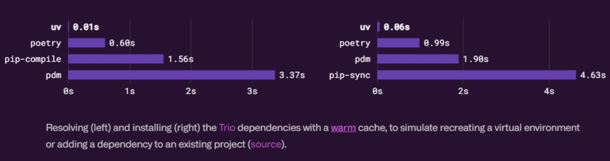

+++
title = 'UV is the latest attempt to rule All Python tools'
description = "... which is also backed by Rust"
slug = "uv-is-latest-attempt-to-rule-them-all"
date = 2024-02-21T15:23:13+08:00
authors = ["Zeyang Lin"]
tags = ["rust", "python", "pip", "cli", "linux", "windows"]
categories = ["rust", "python"]
series = ["uv"]
keywords = ["python", "rust", "uv", "linux", "github"]
image = "UV.svg"
draft = false
+++

In short, [`uv`](https://github.com/astral-sh/uv) is a command line tool written in [`Rust`](https://www.rust-lang.org/) for `Python` developers, which aims to be *"a comprehensive project and package manager that is extremely fast, reliable, and easy to use"*.

If you are still interested, I hope you can spend a couple of minutes so that I can give you a quick tour of it.

## Quick fact sheet

language: Rust

version: 0.1.13 (at the time of updating this post)

repo: [github](https://github.com/astral-sh/uv) (6k stars)

pypi: [pypi](https://pypi.org/project/uv/)

docs: N/A

supported python versions: 3.8 through 3.12 (inclusive)

supported os: Windows, Linux, MacOS

## Drop-in replacement for pip and more

`uv` is from the creator of [`ruff`](https://github.com/astral-sh/ruff), [Charlie Marsh](https://github.com/charliermarsh) and [astralsh](https://github.com/astral-sh/).

`ruff`, the linting and formating tool written is Rust as well, has already gain fame and popularity during the past year or so, and I believe many of Python developers have been using it for quite a while.

And `uv` is no doubt their next step in improving the Python toolchain eco.

Although you can easily install `uv` using `pip` or `pipx` just like any other Python tool,
essentially it does not rely on your Python interpreter to be installed.

It provides just the binary executable and you can get it easily by running the quick script following
the insructions in its git repo. And that's it, no Python or Rust runtime required till this point.

Creating a virtual environment is now as easy as `uv venv`, though you now need at least one Python interpreter ready to make it work.

The virtual env it creates is just a standard Python venv, except it does not include `pip` by default (however if you need pip, you can let it be included by using an extra flag, or you could install it manually anytime after).

Some of your daily commands can then be like (but faster):

```bash
uv pip install -r requirements.txt
uv pip install black==24.2.0
uv pip compile pyprojects.toml -o requirements.txt
```

## Fast in deed




Just like `ruff` is known as being an extremely fast linter, `uv`'s speed is also impressive.

Here is a short `requirements.txt` from one of my repos:

```text
fastapi==0.109.2
pydantic[email]==2.6.1
python-multipart==0.0.9
uvicorn[standard]==0.27.1

coverage>=7.4.0
httpx>=0.26.0
memray>=1.11.0
pytest>=8.0.0
```

And I gave `uv` a try using github actions. The result on `ubuntu-latest` with Python 3.12 looks like this

```text
> Run uv pip install -r requirements.dev.txt
Resolved 40 packages in 185ms
Downloaded 40 packages in 268ms
Installed 40 packages in 24ms
 + annotated-types==0.6.0
 + anyio==4.3.0
 + certifi==2024.2.2
 + click==8.1.7
 + coverage==7.4.2
 + dnspython==2.6.1
 + email-validator==2.1.0.post1
 + fastapi==0.109.2
 + h11==0.14.0
 + httpcore==1.0.3
 + httptools==0.6.1
 + httpx==0.26.0
 + idna==3.6
 + iniconfig==2.0.0
 + jinja2==3.1.3
 + linkify-it-py==2.0.3
 + markdown-it-py==3.0.0
 + markupsafe==2.1.5
 + mdit-py-plugins==0.4.0
 + mdurl==0.1.2
 + memray==1.11.0
 + packaging==23.2
 + pluggy==1.4.0
 + pydantic==2.6.1
 + pydantic-core==2.16.2
 + pygments==2.17.2
 + pytest==8.0.1
 + python-dotenv==1.0.1
 + python-multipart==0.0.9
 + pyyaml==6.0.1
 + rich==13.7.0
 + sniffio==1.3.0
 + starlette==0.36.3
 + textual==0.52.1
 + typing-extensions==4.9.0
 + uc-micro-py==1.0.3
 + uvicorn==0.27.1
 + uvloop==0.19.0
 + watchfiles==0.21.0
 + websockets==12.0
```

As you can see, this process, including solving the dependencies, downloading them and installing them, took just **less than half a second**!

## Features in need

`uv`'s vision, according to the blog, is

> a single binary that bootstraps your Python installation and gives you everything you need to be productive with Python, bundling not only pip, pip-tools, and virtualenv, but also pipx, tox, poetry, pyenv, ruff, and more.

And appearantly at the current point, it is still quite far away from that.

The only two major top-level sub-commands the cli currently supports are

- venv
- pip
- cache

It thus can only create a virtual environment, install dependencies into it and outputs a "lock" file, etc.

I want it to list installed packages, or run commands using the interpreter inside the virtual env, just like what `poetry` is capable of right now.

Not to mention that it cannot run tests, switch virtual environments or lint source files.

But it's still in its early age, and the pace is like one patch version every couple of days, isn't it?

## What about Rye

The ambitions of `uv` share a lot with those from `Rye`, a tool (which happens to be written in Rust as well) created by Armin Ronacher, the creator of `Flask`.

What's more, the team behind `uv`, `astralsh`, is actually taking over the dev work of `Rye` according to their [blog](https://astral.sh/blog/uv), and ultimately going to migrate `Rye` to `uv` in the future.

> We saw this as a rare opportunity to team up, and to avoid fragmenting the Python ecosystem. As such, in collaboration with Armin, we're excited to be taking over Rye. Our goal is to evolve uv into a production-ready "Cargo for Python", and to provide a smooth migration path from Rye to uv when the time is right.

## Some thoughts

The name `uv` seems not relevant to [`libuv`](https://github.com/libuv/libuv), [`uvloop`](https://github.com/MagicStack/uvloop) or [`uvicorn`](https://github.com/encode/uvicorn).

Maybe it's short for "universal/ultimate/unified virtualenv manager"?

The dedicated docs pages of `uv` are not present at the time of writing, which is a pitty.

## References

- [uv: Python packaging in Rust](https://astral.sh/blog/uv)
- [uv on Github](https://github.com/astral-sh/uv)
